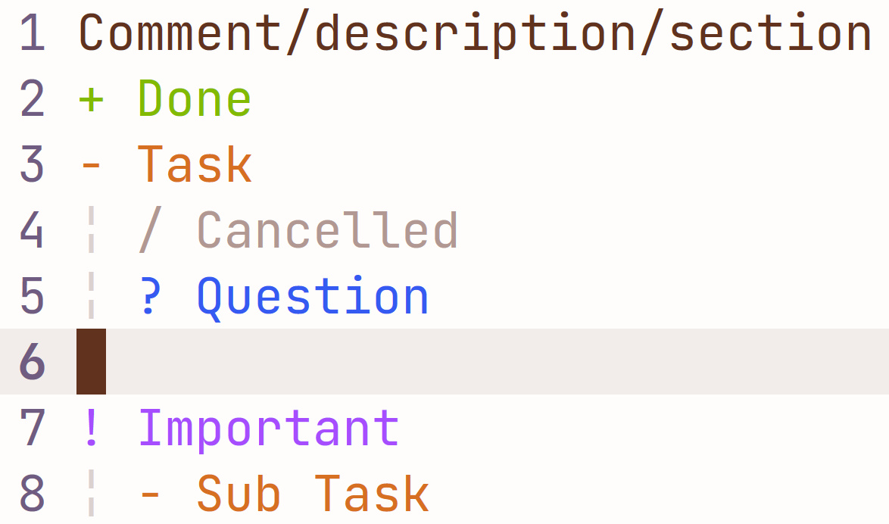
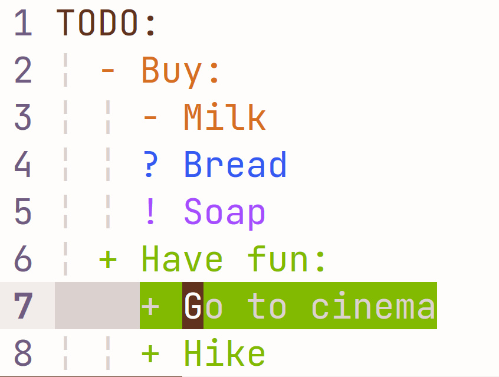

# TODOTXT for Vim

This simple syntax for vim allows for easy creation of simple TODO files.

Whitespaces don't matter and tabulation can be useful for tree-like structure:

## Installation

Move `todotxt.vim` to `~/vimfiles/syntax` (Windows) or `~/.vim/syntax` (Unix)

Also make sure that syntax is enabled in your `vimrc` file by `syntax enable`

[More info about syntax files](vim.wikia.com/wiki/Creating_your_own_syntax_files)

All examples are shown in solarized light color palette. Unfortunately, right now colors will be off in other color schemes.
